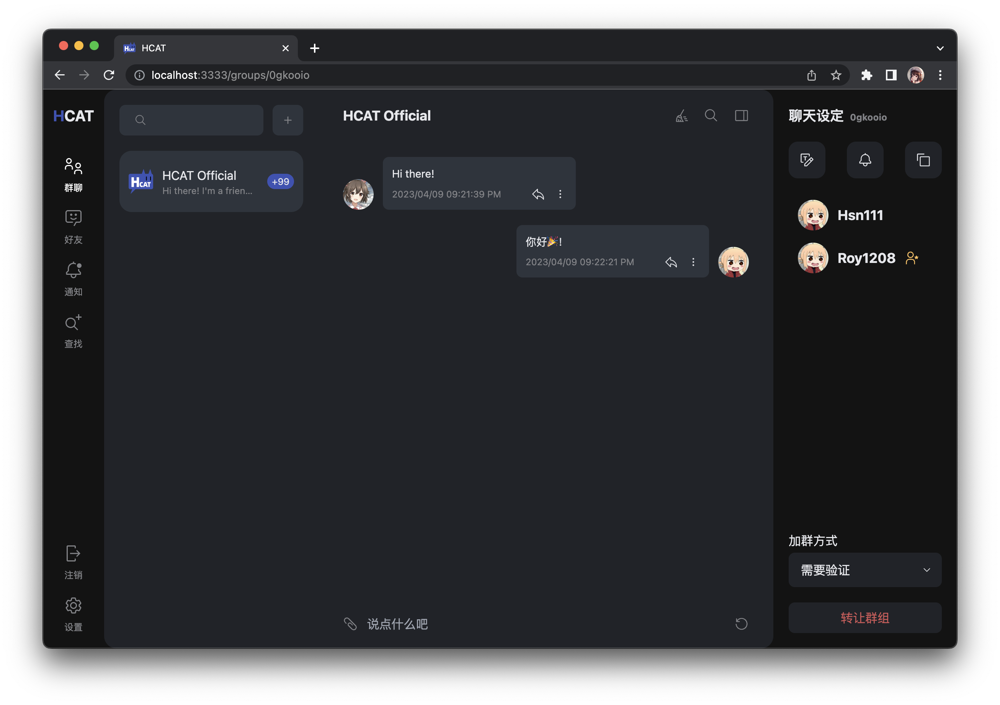

# 介绍

hcat-client客户端的vue版本，仍在开发中。

# 安装

由于本项目仅为静态客户端资源，您需要配合[re_hcat-server](https://github.com/HCAT-Project/re_hcat-server)使用。[re_hcat-server](https://github.com/HCAT-Project/re_hcat-server)是[HCAT-Project](https://github.com/HCAT-Project)的核心项目，作为服务端使用，您可以前往其仓库学习安装方法。


# 预览
<!-- 插入图片 -->


# 开发

```
pnpm install
pnpm dev
```

# 功能

同[re_hcat-server](https://github.com/HCAT-Project/re_hcat-server#%E5%B7%B2%E5%AE%9E%E7%8E%B0%E7%9A%84%E5%8A%9F%E8%83%BD)，我们会紧跟服务端的更新。

# 许可证

本程序为自由软件，在自由软件联盟发布的GNU通用公共许可协议的约束下，你可以对其进行再发布及修改。协议版本为第三版或（随你）更新的版本。
我们希望发布的这款程序有用，但不保证，甚至不保证它有经济价值和适合特定用途。详情参见GNU通用公共许可协议。
你理当已收到一份GNU通用公共许可协议的副本，如果没有，请查阅<http://www.gnu.org/licenses/>

# 免责声明

本项目仅供学习交流使用，使用者应遵守所在国家和地区的相关法律法规，对于任何非法使用所产生的后果，本项目概不负责。
